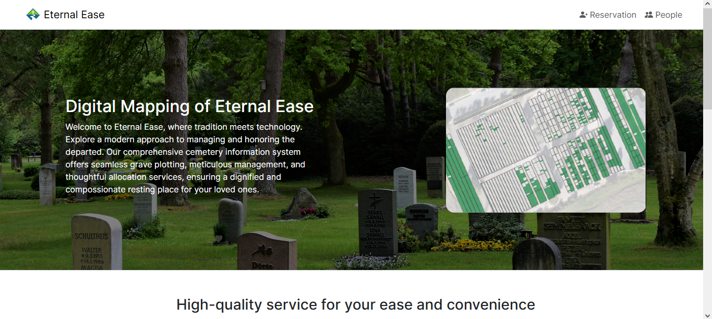
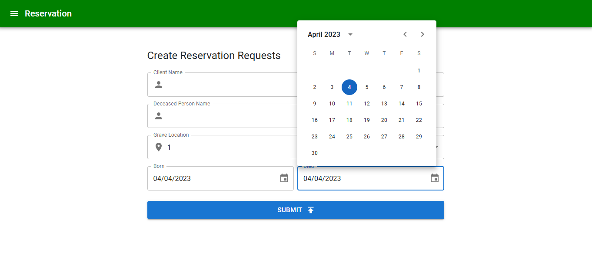

# About

Cemetery Information System is a system for for managing deceased persons information and their graves. Users can create reservation requests and view information about other people's grave or deceased person. The admin can aprove reservation requests created by the users as well as read or delete reservation requests and deceased person document. The application uses Firebase for authentication, database and hosting the website. The website can be visited via [HERE](https://cemetery-information-sys-203df.web.app/)

## Functions

- (Client users) Create reservation requests
- (Client users) Read deceased person document
- (Admin only) Read/Approve/Create/Update/Delete reservation requests document
- (Admin only) Read/Write deceased person document

## Quick Preview

    
    

## Disclaimer

Information in the site such as name and other details is fictional and does not exists in real life. It's purpose is to provide dummy or test data for the website.
